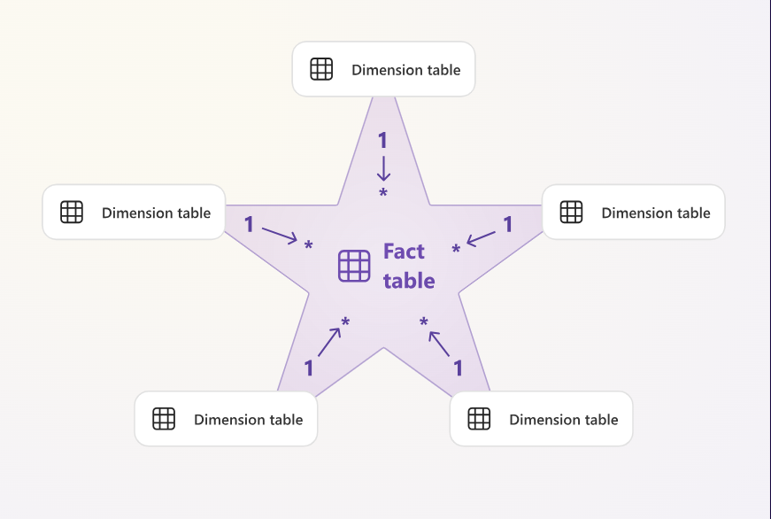
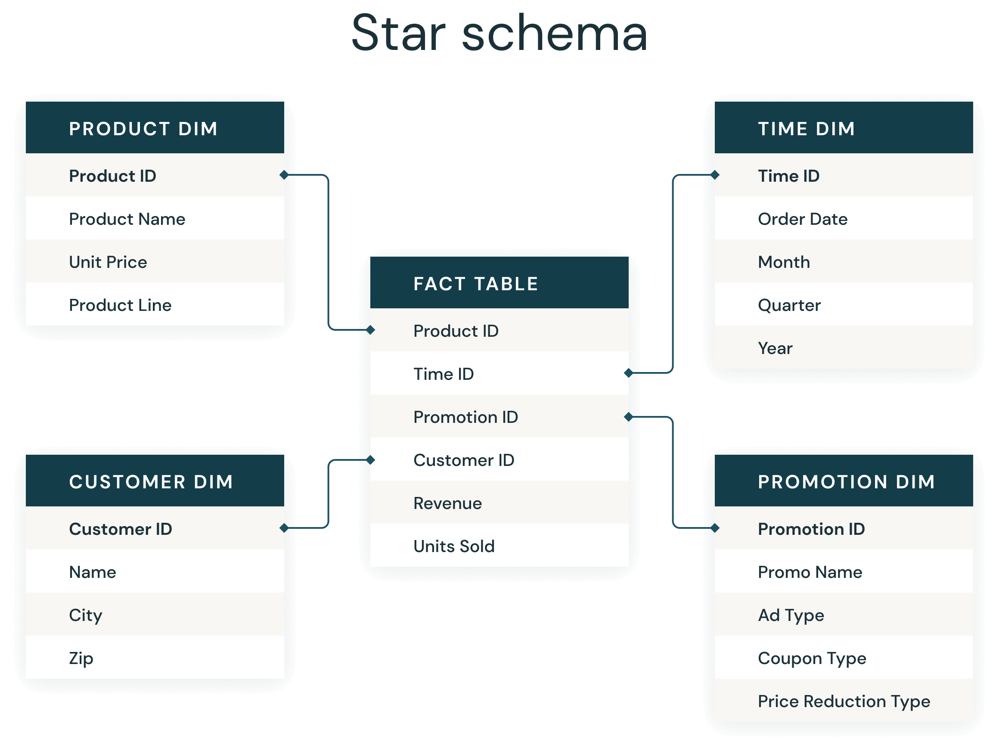

PC1 - primeira entrega do trabalho

- Enxuta dos dados
- Documentação camada Bronze → Dicionário de dados / Analytics / Notebook Python
- MySQL, Tabel, DDL → Lakehouse (Silver)
- Job ETL (Raw → Silver → Silver)
- Lakehouse populada – Início
- Banco de Dados Containerizado
- Script Python que popula o banco quando executa o docker-compose up

# Star Schema
Um esquema em estrela é um modelo multidimensional que organiza os dados em um banco de dados para torná-los mais fáceis de entender e analisar. Pode ser aplicado a data warehouses, bancos de dados, data marts e outras ferramentas. O design do esquema em estrela é otimizado para consultar grandes conjuntos de dados.

Introduzido por Ralph Kimball na década de 90, os esquemas em estrela armazenam dados, gerenciam o histórico e atualizam os dados com eficiência, reduzindo a duplicação de definições de negócios repetitivas e agregando e filtrando dados em data warehouses em alta velocidade.

- ### Exemplo teórico de um Star Schema

- ### Exemplo prático de um Star Schema

